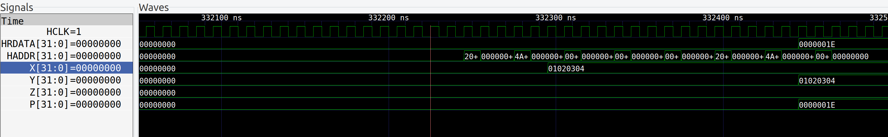

# Chameleon SoC (IBEX)
AHB-Lite based SoC for IBEX

## The Memory Map

## Peripherals
|Peripheral|Bus|Base Address|IRQ #|MPRJ I/O Pins|
|----------|---|------------|--------|-----|
|GPIO (14)|AHB|0x48000000|N/A|0-13|
|UART0|APB|0x40000000|16|20-21|
|UART1|APB|0x40100000|17|22-23|
|SPI0|APB|0x40200000|18|24-27|
|SPI1|APB|0x40300000|19|28-31|
|I2C0|APB|0x40400000|20|32-33|
|I2C1|APB|0x40500000|21|34-35|
|PWM0|APB|0x40600000|n/a|26|
|PWM1|APB|0x40700000|n/a|37|
|TMR0|APB|0x40800000|22|n/a|
|TMR1|APB|0x40900000|23|n/a|
|TMR2|APB|0x40A00000|24|n/a|
|TMR3|APB|0x40B00000|25|n/a|
|WDT0|APB|0x40C00000|26|n/a|
|WDT1|APB|0x40D00000|27|n/a|

## Modified Architecture
Two new accelerators is added to the SoC by connecting them to the AHB bus with a slave interface

## Accelerators connections explained 
### SoC hierarchy:
The Top level file of the verilog code hierarchy is soc_core.v which instantiates the ibex core which is the master of our system and the RAM (of size 3K x 32) along with the AHB bus system which connects both the peripherals (APB slaves) and the rest of the slaves connected on AHB bus.

### AHB Bus system:
The AHB bus system passes all the signals of the master (ibex core) to the five slaves and to the bus. The AHB bus selects which slave will use the bus now through checking on the base address of the HADDR signal and accordingly set the HREADY signal and HRDATA that will be sent back to the master and set the HSEL signals for ech slave which will be only 1 for the acting slave and 0 for the rest. 

## Accelerators connections testing 

## Future Work
To make the acceleration more efficient, we want the accelerators to directly access the memory without the interaction with ibex core at all inorder to decrease the overhead of loading two times; one to read from the memory and one to load the data to the accelerator. We are now integrating a direct memory access (DMA) system through adding (DMA controller) DMAC which will have both a master and slave interface. The slave interface to get configured using the master core and a master interface to be able to read from the memory. 

